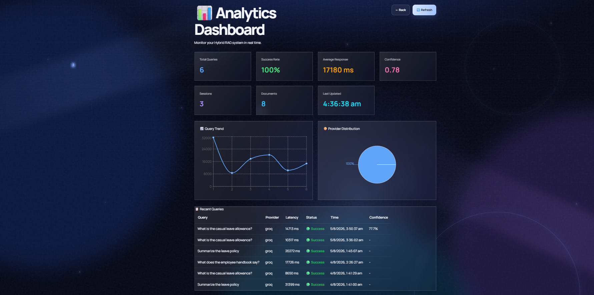
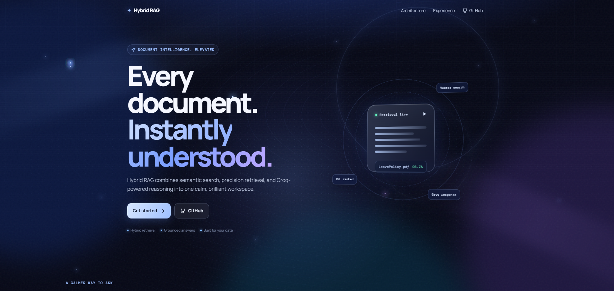
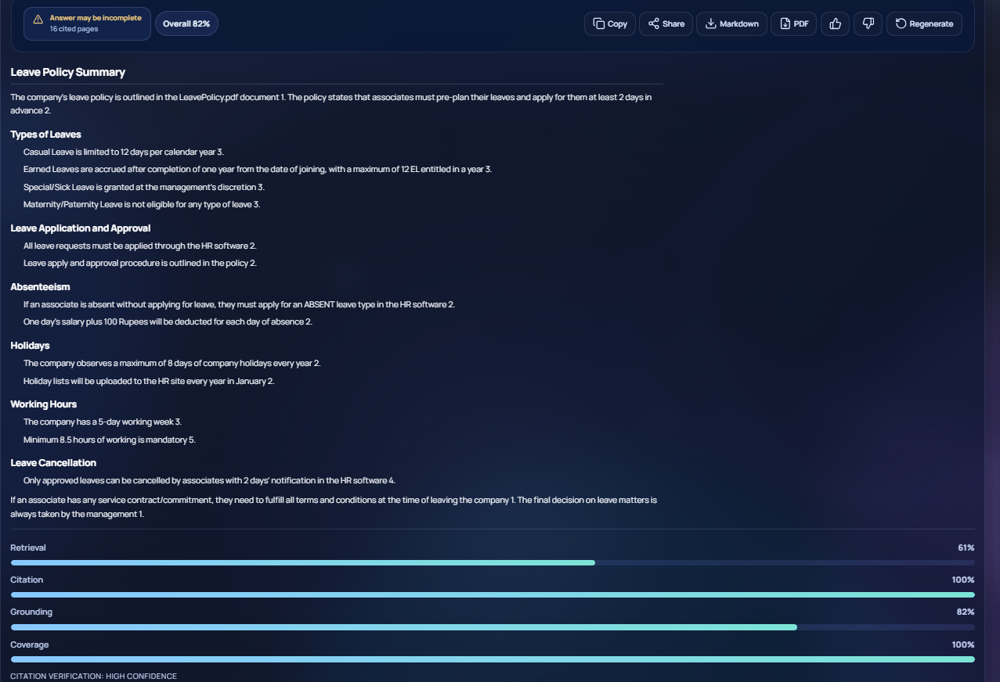
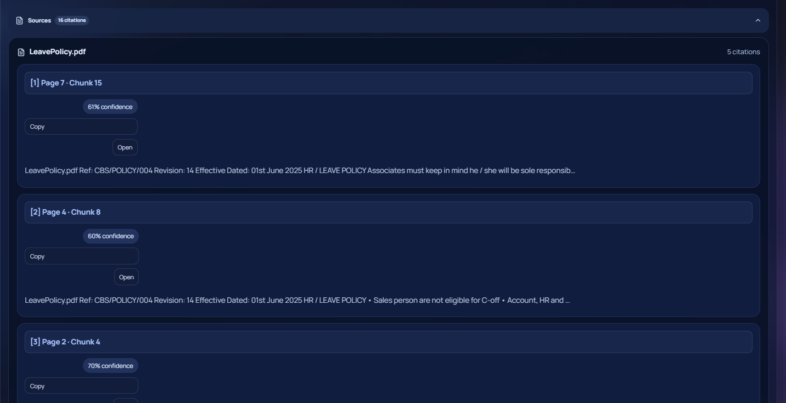

# 🚀 Enterprise Hybrid RAG Search System

> A production-ready Retrieval-Augmented Generation (RAG) platform that combines semantic vector search, BM25 keyword search, Reciprocal Rank Fusion (RRF), CrossEncoder reranking, AI agent-based query planning, and citation verification to deliver accurate, explainable, and streaming answers from PDF documents.

---


---

# 📖 Overview

Enterprise Hybrid RAG Search System is an intelligent document question-answering platform built using Retrieval-Augmented Generation (RAG).

Users can upload one or more PDF documents and ask natural language questions. The system automatically extracts document content, generates embeddings, indexes documents using both semantic vector search and BM25 keyword search, retrieves the most relevant information using Hybrid Search with Reciprocal Rank Fusion (RRF), reranks results using a CrossEncoder model, and generates citation-aware answers using multiple Large Language Models (LLMs).

The platform includes AI agent-based query planning, conversation memory, semantic caching, confidence scoring, streaming responses, analytics, and citation verification, making it suitable for enterprise document search applications.

---
# 🌟 Highlights

- Hybrid Retrieval (BM25 + Semantic Search)
- Reciprocal Rank Fusion (RRF)
- CrossEncoder Reranking
- Multi-LLM Support (Groq, OpenAI, Gemini, Ollama)
- AI Planner–Executor Architecture
- Conversation Memory
- Semantic Cache
- Streaming Responses (SSE)
- Citation Verification
- Confidence Scoring
- Analytics Dashboard
- Docker Support

# ✨ Features

## 📄 Document Processing

- PDF Upload & Processing
- Automatic Text Extraction
- Intelligent Text Cleaning
- Recursive Text Chunking
- Metadata Extraction
- Multi-PDF Support

---

## 🔎 Hybrid Retrieval

- BM25 Keyword Search
- Semantic Vector Search
- ChromaDB Vector Database
- Reciprocal Rank Fusion (RRF)
- CrossEncoder Reranking
- Configurable Retrieval Pipeline

---

## 🤖 AI & LLM Features

- Multi-LLM Support
  - Groq
  - OpenAI
  - Google Gemini
  - Ollama
- AI Agent Architecture
- Planner–Executor Workflow
- Built-in Agent Tools
- Question Rewriting
- Prompt Engineering
- Citation-Aware Generation

---

## 💬 Chat Features

- Streaming Responses (Server-Sent Events)
- Multi-turn Conversation Memory
- Conversation Summarization
- Semantic Cache
- Markdown Rendering
- Code Syntax Highlighting

---

## 📚 Citation System

- Citation Verification
- Confidence Scoring
- Source Viewer
- Document References
- Retrieval Metrics

---

## Analytics Dashboard

Displays

- Query Trends
- Provider Distribution
- Success Rate
- Average Latency
- Confidence Metrics
- Session Statistics
- Recent Queries


---

## 🎨 User Interface

- Modern React UI
- Responsive Design
- Dark Theme
- Source Panel
- Streaming Chat
- PDF Export

---

# 🏗 System Architecture


```
                    User
                      │
                      ▼
              React Frontend
                      │
                      ▼
               FastAPI Backend
                      │
          ┌───────────┴───────────┐
          ▼                       ▼
      Conversation            Planner
         Memory                  │
                                 ▼
                            Executor
                                 │
                     ┌───────────┴───────────┐
                     ▼                       ▼
               Agent Tools          Hybrid Retrieval
                                            │
                    ┌───────────────────────┼───────────────────────┐
                    ▼                       ▼                       ▼
                 BM25 Search        Vector Search         ChromaDB
                                            │
                                            ▼
                             Reciprocal Rank Fusion
                                            │
                                            ▼
                             CrossEncoder Reranker
                                            │
                                            ▼
                                 Prompt Builder
                                            │
                                            ▼
                                  Multi-LLM Engine
                                            │
                                            ▼
                              Citation Verification
                                            │
                                            ▼
                              Streaming Markdown Answer
                                            │
                                            ▼
                                    React Frontend
```

---

# 🔄 Workflow

1. Upload one or more PDF documents.
2. Extract and clean text.
3. Split text into semantic chunks.
4. Generate embeddings.
5. Store embeddings in ChromaDB.
6. Index documents using BM25.
7. Retrieve relevant chunks using Hybrid Search.
8. Merge rankings using Reciprocal Rank Fusion.
9. Rerank retrieved chunks using CrossEncoder.
10. Planner selects the execution strategy.
11. Executor prepares the final prompt.
12. LLM generates a citation-aware response.
13. Citations are verified.
14. Response is streamed to the frontend.

---

# 🛠 Tech Stack

| Category | Technologies |
|------------|-------------|
| Backend | FastAPI, Python |
| Frontend | React 19, TypeScript, Vite |
| Vector Database | ChromaDB |
| Retrieval | BM25, Vector Search |
| Fusion | Reciprocal Rank Fusion |
| Reranking | BAAI/bge-reranker-base |
| Embeddings | all-MiniLM-L6-v2 |
| LLMs | Groq, OpenAI, Gemini, Ollama |
| Streaming | Server-Sent Events (SSE) |
| Database | SQLite, Analytics Database
| Styling | CSS |
| Containerization | Docker |

---
## Repository

https://github.com/Karthikkkr1085/rag-hybrid-search


# 📂 Project Structure

```text
rag-hybrid-search/

├── frontend/
│   ├── src/
│   ├── public/
│   └── package.json
│
├── src/
│   ├── agents/
│   ├── analytics/
│   ├── api/
│   ├── cache/
│   ├── chunking/
│   ├── evaluation/
│   ├── generation/
│   ├── ingestion/
│   ├── memory/
│   ├── models/
│   ├── retrieval/
│   ├── vectorstore/
│   └── verification/
│
├── data/
├── docs/
├── scripts/
├── tests/
├── Dockerfile
├── docker-compose.yml
├── requirements.txt
└── README.md
```

---

# 🚀 Installation

## Clone Repository

```bash
git clone https://github.com/Karthikkkr1085/rag-hybrid-search.git

cd rag-hybrid-search
```

---

## Backend

Create virtual environment

```bash
python -m venv venv
```

Activate

### Windows

```bash
venv\Scripts\activate
```

### Linux/macOS

```bash
source venv/bin/activate
```

Install dependencies

```bash
pip install -r requirements.txt
```

---

## Environment Variables

Create `.env`

```env
GROQ_API_KEY=

OPENAI_API_KEY=

GOOGLE_API_KEY=

OLLAMA_API_KEY=dummy
```

---

## Start Backend

```bash
uvicorn src.api.main:app --reload
```

API

```
http://localhost:8000
```

Swagger

```
http://localhost:8000/docs
```

---

## Frontend

```bash
cd frontend

npm install

npm run dev
```

```
http://localhost:5173
```

---

# 🐳 Docker

```bash
docker compose up --build
```

---

# 📡 API Endpoints

| Method | Endpoint | Description |
|----------|-------------------------|------------------------------|
| GET | / | API Status |
| GET | /health | Health Check |
| POST | /query | Ask Question |
| POST | /query/stream | Streaming Response |
| POST | /documents/upload | Upload Documents |

---

# 💬 Example Queries

## Policy Documents

- What is the leave policy?
- Explain the probation period.
- Compare casual leave and earned leave.
- Summarize the attendance policy.
- What are the working hours?

---

## Technical Documents

- What is Python?
- Explain string slicing.
- Compare lists and tuples.
- Explain recursion.
- Summarize Chapter 3.

---

# 📸 Screenshots

## Home



---

## Chat



---

## PDF Upload


---

## Citation Panel



---

## Analytics


---

# 🎥 Demo

Live Demo

Coming Soon

Demo Video

Coming Soon
---

# 📊 Supported Features

| Feature | Status |
|-------------------------------|:------:|
| PDF Upload | ✅ |
| Multi PDF | ✅ |
| Hybrid Search | ✅ |
| BM25 | ✅ |
| Vector Search | ✅ |
| RRF | ✅ |
| CrossEncoder | ✅ |
| Planner Agent | ✅ |
| Executor Agent | ✅ |
| Agent Tools | ✅ |
| Multi-LLM | ✅ |
| Streaming | ✅ |
| Conversation Memory | ✅ |
| Semantic Cache | ✅ |
| Citation Verification | ✅ |
| Confidence Scoring | ✅ |
| Analytics | ✅ |
| Markdown Rendering | ✅ |
| PDF Export | ✅ |
| Docker | ✅ |

---

# 🔮 Future Improvements

- OCR Support
- Table Extraction
- Image Retrieval
- Authentication
- User Accounts
- Role-Based Access Control
- Kubernetes Deployment
- Distributed Vector Database

---

# 🤝 Contributing

Contributions are welcome.

1. Fork the repository

2. Create a feature branch

```bash
git checkout -b feature-name
```

3. Commit

```bash
git commit -m "Add feature"
```

4. Push

```bash
git push origin feature-name
```

5. Open a Pull Request

---

# 📄 License

Licensed under the MIT License.

---

# 👨‍💻 Author

Karthik R

🔗 GitHub
https://github.com/Karthikkkr1085

🔗 LinkedIn
https://www.linkedin.com/in/karthikr1085

---

## ⭐ Support

If you like this project, please consider giving it a ⭐ on GitHub.

It helps others discover the project and supports future improvements.

---